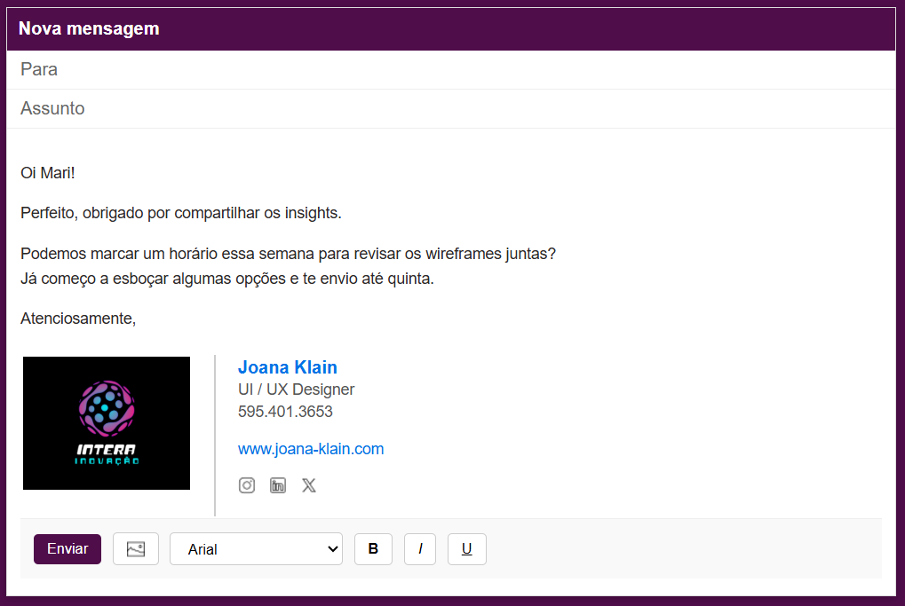

# Signature Template

Ese projeto é um mockup (protótipo) de assinaturas de e-mails desenvolvido com **HTML** e **CSS**.  Apenas para simular uma nova mensagem com campos básicos, de uma assinatura profissional com imagem e redes sociais.

# Tecnologias Utilizadas

HTML5
CSS3

## Objetivo

Template criado para fins de demonstração UI/UX design e estilização com CSS.
